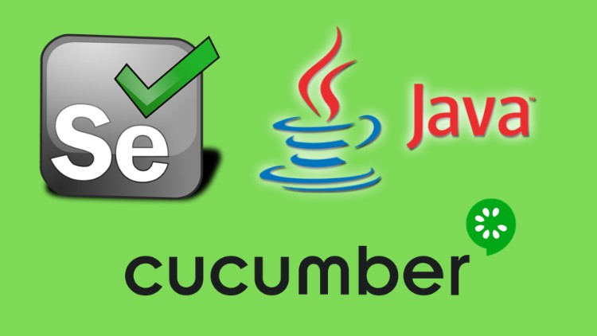

# 🧪 Cucumber BDD Automation - Todo Project

## 🚀 Overview
This project demonstrates a **BDD automation framework** using Cucumber, Java, and Maven.

It validates a Todo application by writing human-readable scenarios using Gherkin.

---

## 🧱 Tech Stack
- Java
- Cucumber (BDD)
- JUnit
- Maven

---

## ✅ Features
- Behavior Driven Development (BDD)
- Gherkin scenarios
- Automated test execution
- HTML reporting
- CI/CD with GitHub Actions

---

## ▶️ Run Tests

```bash
mvn clean test